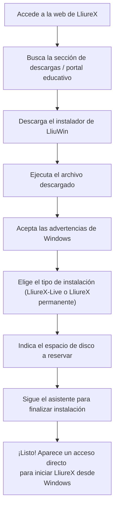

```mermaid
flowchart TD
    A["Accede a la web de LliureX"] --> B["Busca la sección de descargas / portal educativo"]
    B --> C["Descarga el instalador de LliuWin"]
    C --> D["Ejecuta el archivo descargado"]
    D --> E["Acepta las advertencias de Windows"]
    E --> F["Elige el tipo de instalación <br> (LliureX-Live o LliureX permanente)"]
    F --> G["Indica el espacio de disco a reservar"]
    G --> H["Sigue el asistente para finalizar instalación"]
    H --> I["¡Listo! Aparece un acceso directo <br> para iniciar LliureX desde Windows"]
```
