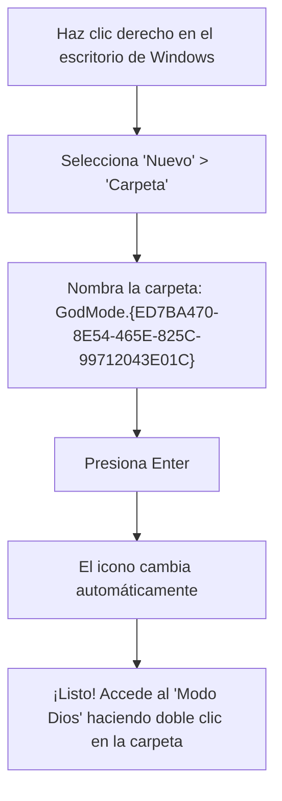

```mermaid
flowchart TD
    A["Haz clic derecho en el escritorio de Windows"] --> B["Selecciona 'Nuevo' > 'Carpeta'"]
    B --> C["Nombra la carpeta: GodMode.{ED7BA470-8E54-465E-825C-99712043E01C}"]
    C --> D["Presiona Enter"]
    D --> E["El icono cambia automáticamente"]
    E --> F["¡Listo! Accede al 'Modo Dios' haciendo doble clic en la carpeta"]
```
