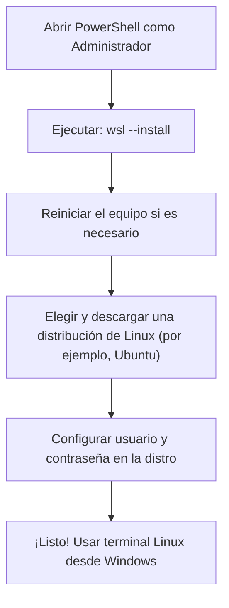

```mermaid
flowchart TD
    A["Abrir PowerShell como Administrador"] --> B["Ejecutar: wsl --install"]
    B --> C["Reiniciar el equipo si es necesario"]
    C --> D["Elegir y descargar una distribución de Linux (por ejemplo, Ubuntu)"]
    D --> E["Configurar usuario y contraseña en la distro"]
    E --> F["¡Listo! Usar terminal Linux desde Windows"]
```
