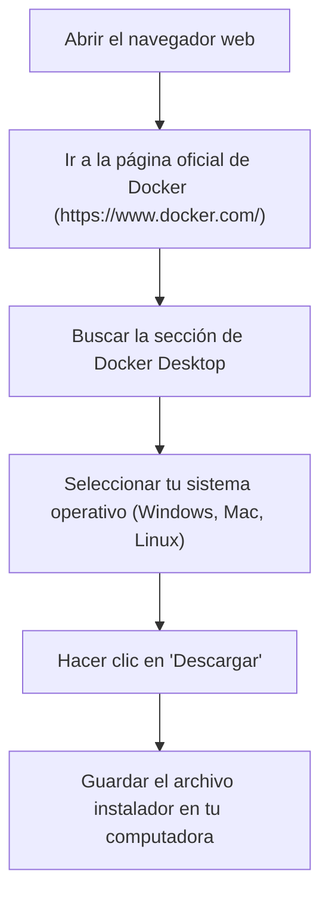

```mermaid
flowchart TD
    A["Abrir el navegador web"] --> B["Ir a la página oficial de Docker (https://www.docker.com/)"]
    B --> C["Buscar la sección de Docker Desktop"]
    C --> D["Seleccionar tu sistema operativo (Windows, Mac, Linux)"]
    D --> E["Hacer clic en 'Descargar'"]
    E --> F["Guardar el archivo instalador en tu computadora"]
```
